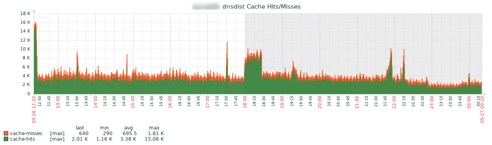
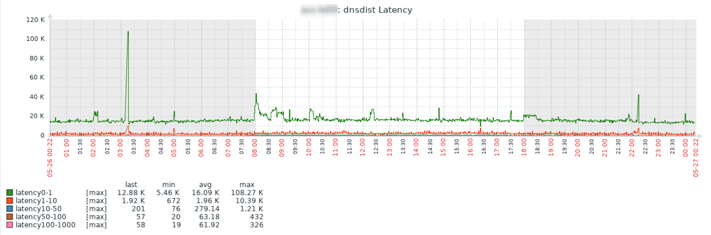
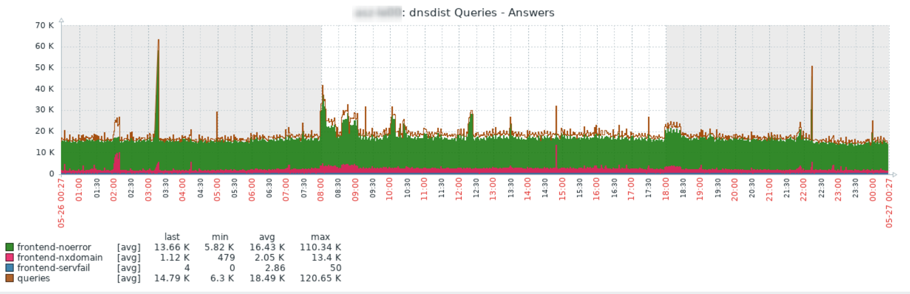

# Zabbix Template: App PowerDNS dnsdist

Self-contained Zabbix template to get information about PowerDNS dnsdist.

## About

This is a self-contained Zabbix template. It uses the [Built-in webserver](https://dnsdist.org/guides/webserver.html) to gather the [statistics](https://dnsdist.org/statistics.html) and creates over 50 Items.

## Installation

The [built-in webserver](https://dnsdist.org/guides/webserver.html) on the dnsdist have to be activated, to access the required information.
```
webserver("127.0.0.1:8083", "supersecretpassword", "supersecretAPIkey")
```
Make sure to change supersecretpassword and supersecretAPIkey to some random values!

Assign the template to your host and configure the macros {$PDNS.DNSDIST.APIKEY} {$PDNS.DNSDIST.WEBSERVER.IP} and {$PDNS.DNSDIST.WEBSERVER.PORT} according to your setup.

To match the example from above:
```
{$PDNS.DNSDIST.APIKEY} supersecretAPIkey
{$PDNS.DNSDIST.WEBSERVER.IP} 127.0.0.1
{$PDNS.DNSDIST.WEBSERVER.PORT} 8083
```

## Examples

### Graph: Cache Hits/Misses



### Graph: Latency



### Graph: Queries - Answers



